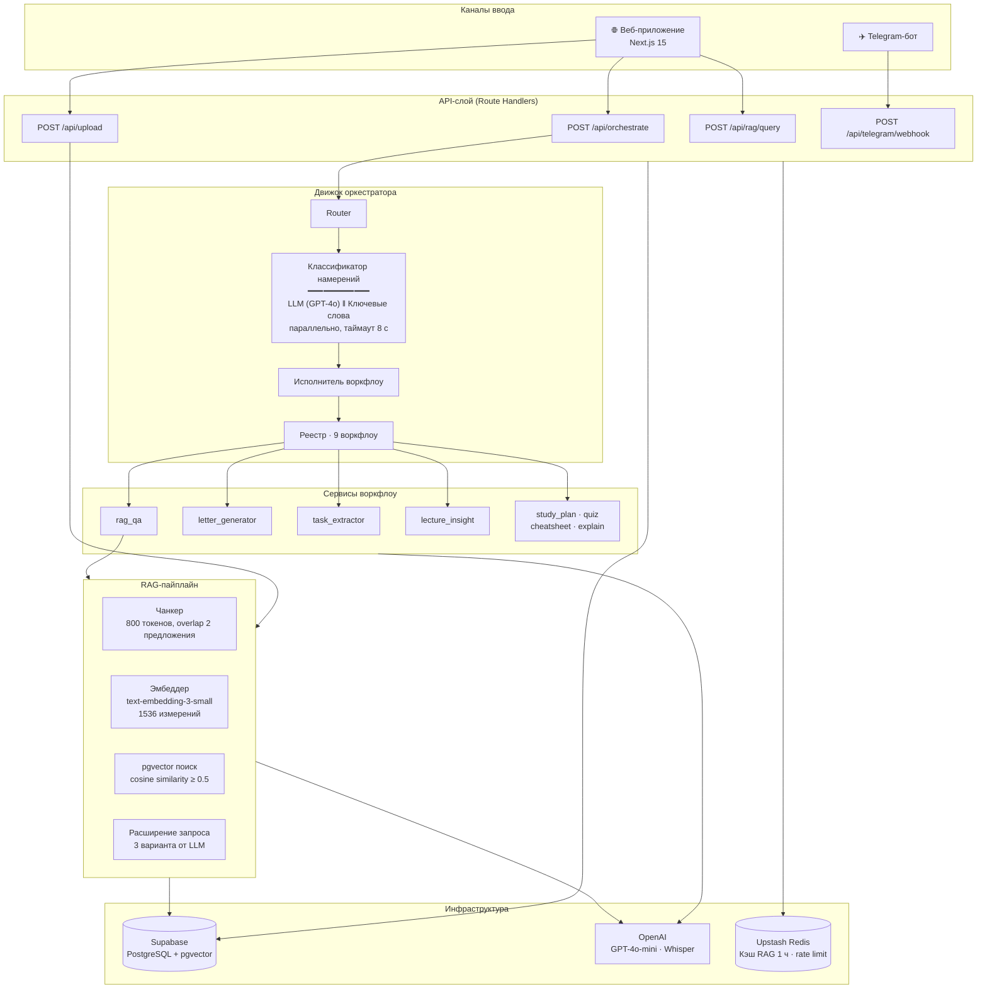

<div align="center">

# StudyFlow AI

**AI-оркестратор, который маршрутизирует запросы студентов на естественном языке в нужный рабочий процесс**


*Опиши задачу своими словами. StudyFlow выберет нужный инструмент и выполнит работу.*

</div>

---

## Как это работает

Студент пишет запрос в **веб-приложении** или **Telegram-боте** на естественном языке. Система классифицирует намерение с помощью LLM, маршрутизирует запрос в один из девяти AI-воркфлоу и возвращает структурированный результат.

```
"Найди что Кейнс говорил про спрос в моих конспектах"
           ↓  классификация  (GPT-4o + keyword fallback)
           ↓  intent = rag_qa  |  confidence = 0.91
           ↓  выполнение  → pgvector поиск → синтез GPT-4o-mini
           ↓
     { answer, citations: [{ title, excerpt, similarity }] }
```

---

## Воркфлоу

| Воркфлоу | Пример запроса | Результат |
|---|---|---|
| `rag_qa` | «Что написано в главе 3 про монополии?» | Ответ с цитатами из документов |
| `letter_generator` | «Напиши заявление на академотпуск декану» | Текст официального письма |
| `task_extractor` | «Выдели все дедлайны из этой программы курса» | Структурированный список задач с датами |
| `lecture_insight` | «Сделай конспект этой 2-часовой записи» | Заголовок, резюме, ключевые тезисы, определения |
| `study_plan` | «Составь план подготовки к экзамену на 2 недели» | Расписание по дням |
| `quiz_generator` | «Сделай тест по главе 3» | MCQ + открытые вопросы |
| `cheat_sheet` | «Сожми это в шпаргалку» | Плотное резюме с терминологией |
| `explain_this` | «Объясни предельную полезность простыми словами» | Объяснение с примерами |
| `route_recommender` | *(неоднозначный запрос)* | UI с карточками воркфлоу для уточнения |

---

## Архитектура



**Политика confidence** — классификатор возвращает оценку уверенности от 0.0 до 1.0:

| Оценка | Действие |
|---|---|
| ≥ 0.75 | Выполнить воркфлоу напрямую |
| 0.45 – 0.74 | Показать WorkflowPicker, уточнить намерение |
| < 0.45 | Общий fallback со списком всех воркфлоу |

---

## Технологический стек

| Слой | Технология |
|---|---|
| Фреймворк | Next.js 15 · App Router · Turbopack |
| Язык | TypeScript 5.7 (strict) |
| База данных | Supabase · PostgreSQL 15 · RLS |
| Векторный поиск | pgvector · косинусное сходство, 1536 измерений |
| LLM | OpenAI GPT-4o-mini (классификация + генерация) |
| Эмбеддинги | OpenAI text-embedding-3-small |
| Speech-to-Text | OpenAI Whisper |
| Кэш | Upstash Redis REST API (без SDK) |
| Стили | Tailwind CSS 3 + дизайн-система ВШЭ (CSS-переменные) |
| Мониторинг ошибок | Sentry |
| Бот | Telegram Bot API |
| Контейнер | Docker multi-stage build |

---

## Быстрый старт

### Docker (рекомендуется)

```bash
git clone https://github.com/your-org/studyflow-ai
cd studyflow-ai
cp .env.example .env.local   # заполнить все ключи

docker compose up --build
# → http://localhost:3000
```

### Локальная разработка

```bash
npm install
npm run dev    # Turbopack → http://localhost:3000
```

### Обязательные переменные окружения

```env
NEXT_PUBLIC_APP_URL=http://localhost:3000
NEXT_PUBLIC_SUPABASE_URL=https://<project>.supabase.co
NEXT_PUBLIC_SUPABASE_ANON_KEY=<anon key>
SUPABASE_SERVICE_ROLE_KEY=<service role key>   # только сервер, не публиковать
OPENAI_API_KEY=sk-...                          # только сервер
TELEGRAM_BOT_TOKEN=<bot token>                 # только сервер
TELEGRAM_WEBHOOK_SECRET=<случайный hex 32 байта>
```

Полный список с описанием — [.env.example](.env.example)

### Применение миграций БД

```bash
# Вариант 1 — Supabase CLI
npx supabase db push

# Вариант 2 — вручную (Supabase Dashboard → SQL Editor)
# Запустить файлы из supabase/migrations/ по порядку: 0001 → 0006
```

### Регистрация Telegram-вебхука (локально)

```bash
# Открыть публичный HTTPS-туннель
cloudflared tunnel --url http://localhost:3000

# Задать в .env.local: NEXT_PUBLIC_APP_URL=https://xxxx.trycloudflare.com
npx tsx scripts/setup-telegram-webhook.ts
```

---

## Структура проекта

```
├── app/
├── lib/
├── components/
├── supabase/
├── scripts/
├── docs/
├── Dockerfile
└── docker-compose.yml
```

Подробнее о структуре: `docs/dev-structure.md`.

---

## Краткий справочник API

Все endpoints требуют `Authorization: Bearer <supabase_jwt>`, кроме `/api/telegram/webhook`.

| Метод | Endpoint | Описание |
|---|---|---|
| `POST` | `/api/orchestrate` | Текст → классификация намерения → выполнение воркфлоу |
| `POST` | `/api/upload` | Загрузка PDF / TXT / аудио (асинхронная обработка) |
| `GET` | `/api/documents/:id/status` | Опрос статуса обработки документа |
| `POST` | `/api/rag/query` | Семантический вопрос-ответ по документам |
| `POST` | `/api/chat` | Диалоговый ассистент |
| `POST` | `/api/letters/generate` | Генерация официального письма |
| `POST` | `/api/tasks/extract` | Извлечение задач и дедлайнов |
| `POST` | `/api/quiz/generate` | Генерация тестовых вопросов |
| `POST` | `/api/cheatsheet/generate` | Генерация шпаргалки |
| `POST` | `/api/planner/build` | Составление учебного плана |
| `POST` | `/api/lecture-notes` | Конспект по транскрипту аудио |
| `POST` | `/api/transcribe` | Аудиофайл → текст (Whisper) |
| `POST` | `/api/transcribe/microphone` | Запись с микрофона браузера → текст |
| `POST` | `/api/telegram/webhook` | Обновления Telegram Bot |
| `POST` | `/api/analytics/event` | Запись события продуктовой аналитики |
| `GET` | `/api/health` | Health check |

Полные схемы запросов/ответов → [docs/api.md](docs/api.md)

---

## Документация

| Файл | Содержание |
|---|---|
| [docs/architecture.md](docs/architecture.md) | Слои системы, компонентная диаграмма, архитектурные инварианты |
| [docs/orchestrator.md](docs/orchestrator.md) | Sequence diagram, стратегия классификации, политика confidence |
| [docs/database.md](docs/database.md) | ERD, описание таблиц, проектирование RLS |
| [docs/rag.md](docs/rag.md) | RAG-пайплайн, алгоритм чанкинга, стратегия эмбеддингов |
| [docs/api.md](docs/api.md) | Полный справочник API со схемами запросов/ответов |
| [docs/deployment.md](docs/deployment.md) | Docker, Vercel, настройка Telegram-вебхука, admin |
| [docs/adr/](docs/adr/) | Architecture Decision Records |

---

## Архитектурные инварианты

1. **Единый реестр** — добавление воркфлоу = одна запись в `lib/orchestrator/registry.ts`, больше ничего не меняется
2. **Сервисы без HTTP** — `lib/services/*` вызываются одинаково из route handler, Telegram-вебхука и CLI-скрипта
3. **Секреты только на сервере** — `SUPABASE_SERVICE_ROLE_KEY`, `OPENAI_API_KEY`, `TELEGRAM_BOT_TOKEN` никогда не попадают в клиентский бандл
4. **Загрузка не блокирует** — `/api/upload` отвечает за <500 мс; чанкинг и эмбеддинги выполняются через `waitUntil()`
5. **Telegram всегда 200** — все ошибки логируются внутри; вебхук никогда не бросает исключение наружу
6. **RLS на всех пользовательских таблицах** — `service_role` клиент используется только в фоновых задачах

---

## Лицензия

MIT © 2025 StudyFlow AI
