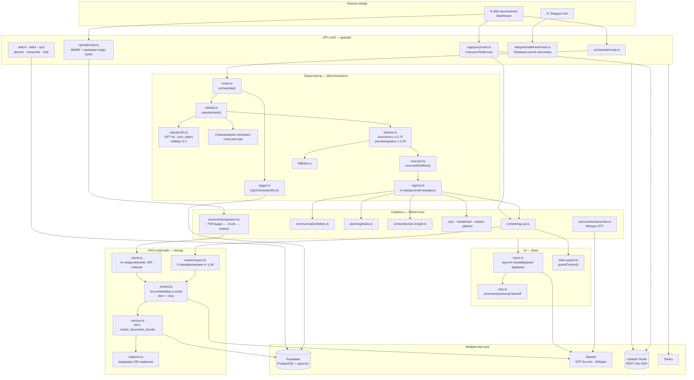
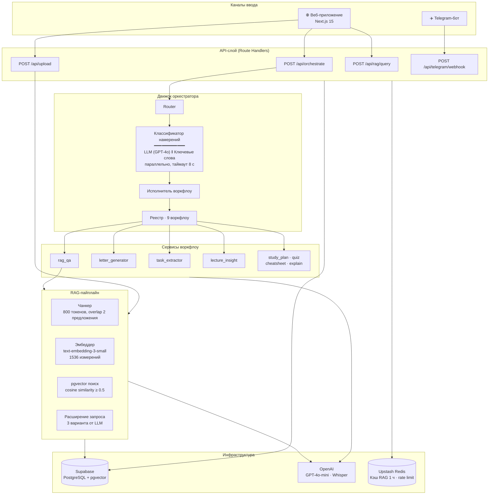

# Архитектура системы

## Обзор

StudyFlow AI построен в виде шести горизонтальных слоёв. Каждый слой зависит только от слоёв ниже — импорты вверх по стеку запрещены.

```
┌─────────────────────────────────────────────────────────────────┐
│                         Каналы ввода                            │
│         Веб-приложение (Next.js 15)  │  Telegram-бот            │
├─────────────────────────────────────────────────────────────────┤
│                           API-слой                              │
│   Route Handlers · Проверка auth · Валидация · JSON-ответ      │
├─────────────────────────────────────────────────────────────────┤
│                       Движок оркестратора                       │
│        Классификация намерения → Оценка confidence → Роутинг   │
├─────────────────────────────────────────────────────────────────┤
│                        Сервисы воркфлоу                         │
│   rag_qa · letter · tasks · lecture · plan · quiz · explain    │
├─────────────────────────────────────────────────────────────────┤
│                         Знания / RAG                            │
│         Chunk  ·  Embed  ·  Retrieve  ·  Expand  ·  Cite       │
├─────────────────────────────────────────────────────────────────┤
│                      Данные и интеграции                        │
│     Supabase · pgvector · OpenAI · Telegram · Redis · Sentry   │
└─────────────────────────────────────────────────────────────────┘
```

---

## Компонентная диаграмма



---

## Диаграмма потоков (из README)



**Политика confidence** — классификатор возвращает оценку уверенности от 0.0 до 1.0:

| Оценка | Действие |
|---|---|
| ≥ 0.75 | Выполнить воркфлоу напрямую |
| 0.45 – 0.74 | Показать WorkflowPicker, уточнить намерение |
| < 0.45 | Общий fallback со списком всех воркфлоу |

---

## Жизненный цикл запроса

```
1. Пользователь отправляет текст через веб или Telegram
2. Route handler проверяет auth (Bearer JWT) и форму входных данных
3. Вызывается orchestrate(input) в router.ts
4. LLM-классификатор и сканер ключевых слов запускаются параллельно (таймаут 8 с)
5. Победитель выбирается по confidence — LLM побеждает при ≥ 0.75
6. Confidence проверяется по порогам (policies.ts):
   ≥ 0.75    → executeWorkflow()
   0.45–0.74 → вернуть needsClarification = true
   < 0.45    → buildFallbackResponse()
7. logOrchestratorRun() пишется в analytics_events (async, не блокирует)
8. Возвращается JSON: { ok, workflow, intent, confidence, result }
```

---

## Карта файлов оркестратора

| Файл | Ответственность | Ключевой экспорт |
|---|---|---|
| `registry.ts` | Единственный источник истины для всех воркфлоу | `WORKFLOW_REGISTRY` |
| `classify.ts` | Запускает LLM + ключевые слова параллельно, выбирает победителя | `classifyIntent()` |
| `classify-llm.ts` | Классификация через GPT-4o, json_object, таймаут 8 с | `classifyLLM()` |
| `router.ts` | Собирает полный пайплайн | `orchestrate()` |
| `executor.ts` | Вызывает `workflow.run(text, ctx)` | `executeWorkflow()` |
| `policies.ts` | Пороги confidence | `ORCHESTRATOR_THRESHOLDS` |
| `fallback.ts` | Ответ при слишком низком confidence | `buildFallbackResponse()` |
| `logger.ts` | Асинхронная запись в analytics_events | `logOrchestratorRun()` |

**Правило:** добавление нового воркфлоу = правки только в `registry.ts`.

---

## Архитектурные инварианты

| № | Правило |
|---|---|
| 1 | Новый воркфлоу → одна запись в `registry.ts`, больше ничего |
| 2 | Бизнес-логика только в `lib/services/*` — route handlers — тонкие обёртки |
| 3 | Серверные секреты никогда не попадают в клиентский бандл |
| 4 | Сервисы без HTTP-зависимости — работают из route, вебхука и CLI одинаково |
| 5 | Telegram-вебхук всегда возвращает 200 OK, даже при ошибке |
| 6 | `/api/upload` отвечает за <500 мс; обработка запускается в фоне |
| 7 | `service_role` клиент — только в фоновых задачах, не в пути пользовательского запроса |

---

## Заголовки безопасности

Применяются ко всем маршрутам через `next.config.ts`:

| Заголовок | Значение |
|---|---|
| `X-Content-Type-Options` | `nosniff` |
| `X-Frame-Options` | `DENY` |
| `X-XSS-Protection` | `1; mode=block` |
| `Referrer-Policy` | `strict-origin-when-cross-origin` |
| `Permissions-Policy` | `camera=(), microphone=(self), geolocation=()` |
| `Content-Security-Policy` | Строгий allowlist — см. `next.config.ts` |

---

## Нефункциональные требования

| Метрика | Цель |
|---|---|
| P95 латентность оркестратора | ≤ 5 с |
| Время ответа на загрузку | ≤ 2 с |
| P95 RAG-запрос | ≤ 6 с |
| ACK Telegram-вебхука | ≤ 200 мс |
| Обработка документа | ≤ 60 с |
| Максимальный размер файла | 20 МБ |
| Uptime | 99.5% |
