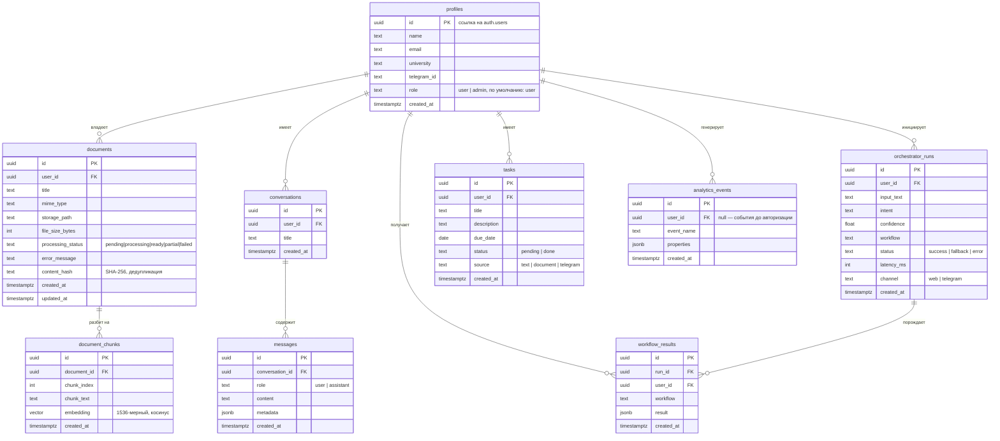
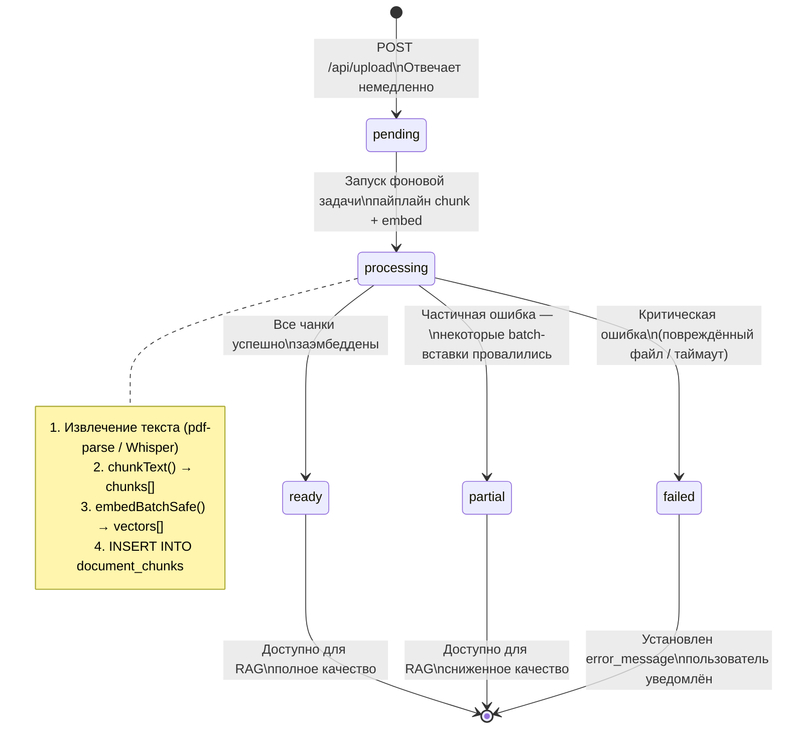

# База данных

## Обзор

PostgreSQL 15 через Supabase с расширением `pgvector` для семантического поиска.

- **9 таблиц** — все пользовательские данные защищены Row Level Security
- **1536-мерные** векторы эмбеддингов (OpenAI text-embedding-3-small)
- **Косинусное сходство** через RPC-функцию `match_document_chunks()`

---

## Диаграмма сущностей (ERD)



---

## Справочник таблиц

### `profiles`
Идентичность пользователя, связана с `auth.users` через триггер при регистрации.

| Колонка | Тип | Описание |
|---|---|---|
| `id` | `uuid` | Совпадает с `auth.users.id` |
| `name` | `text` | Отображаемое имя |
| `email` | `text` | От OAuth-провайдера |
| `university` | `text` | Опционально — ВШЭ или другой вуз |
| `telegram_id` | `text` | ID в Telegram для привязки бота |
| `role` | `text` | `user` \| `admin` (по умолчанию: `user`) |

---

### `documents`
Метаданные файла. Обработка происходит асинхронно после загрузки.

| Колонка | Тип | Описание |
|---|---|---|
| `processing_status` | `text` | Конечный автомат — см. ниже |
| `content_hash` | `text` | SHA-256 байт файла — предотвращает повторную загрузку |
| `error_message` | `text` | Устанавливается при статусе `failed` или `partial` |
| `storage_path` | `text` | Путь в Supabase Storage |

**Конечный автомат статусов обработки:**



---

### `document_chunks`
Текстовые сегменты с 1536-мерными эмбеддингами. Используются для поиска по pgvector.

| Колонка | Тип | Описание |
|---|---|---|
| `chunk_index` | `int` | Позиция в документе, начиная с 0 |
| `chunk_text` | `text` | Исходный текст, ~800 токенов |
| `embedding` | `vector(1536)` | OpenAI text-embedding-3-small |

Индекс: `HNSW` по `embedding` для быстрого косинусного поиска.

---

### `orchestrator_runs`
Журнал аудита каждого решения по классификации и маршрутизации.

| Колонка | Тип | Описание |
|---|---|---|
| `input_text` | `text` | Исходный запрос пользователя (обрезан до 500 символов) |
| `intent` | `text` | Имя классифицированного воркфлоу |
| `confidence` | `float4` | 0.0 – 1.0 |
| `workflow` | `text` | Выполненный воркфлоу (null при fallback) |
| `status` | `text` | `success` \| `fallback` \| `error` |
| `latency_ms` | `int` | Время end-to-end в мс |
| `channel` | `text` | `web` \| `telegram` |

Используется для дашборда аналитики и мониторинга качества модели.

---

### `analytics_events`
Телеметрия продуктовой воронки. Записывается через `trackEvent()`.

| Событие | Когда | Свойства |
|---|---|---|
| `landing_view` | Открыта главная страница | `{ source, utm_* }` |
| `signup_complete` | Создан пользователь | `{ provider }` |
| `first_query` | Первый вызов оркестратора | `{ channel }` |
| `first_workflow_success` | Первый успешный запуск | `{ workflow }` |
| `document_uploaded` | Файл принят | `{ mime_type, size_bytes }` |
| `document_ready` | Эмбеддинг завершён | `{ chunk_count, latency_ms }` |
| `rag_query` | RAG-поиск выполнен | `{ cached, result_count }` |
| `repeat_usage` | 5-я сессия | `{ days_since_signup }` |

---

## RPC-функция векторного поиска

Определена в `supabase/migrations/0002_match_function.sql`:

```sql
CREATE FUNCTION match_document_chunks(
  query_embedding  vector(1536),
  match_threshold  float,
  match_count      int,
  p_user_id        uuid
)
RETURNS TABLE (
  id              uuid,
  document_id     uuid,
  chunk_text      text,
  chunk_index     int,
  similarity      float,
  document_title  text
)
LANGUAGE sql STABLE
AS $$
  SELECT
    dc.id,
    dc.document_id,
    dc.chunk_text,
    dc.chunk_index,
    1 - (dc.embedding <=> query_embedding) AS similarity,
    d.title AS document_title
  FROM document_chunks dc
  JOIN documents d ON d.id = dc.document_id
  WHERE d.user_id = p_user_id
    AND 1 - (dc.embedding <=> query_embedding) > match_threshold
  ORDER BY dc.embedding <=> query_embedding
  LIMIT match_count;
$$;
```

---

## Row Level Security

На всех пользовательских таблицах включён RLS. Политики в `supabase/policies.sql`:

```
profiles        SELECT / UPDATE WHERE id = auth.uid()
documents       ALL WHERE user_id = auth.uid()
document_chunks SELECT WHERE document_id IN (SELECT id FROM documents WHERE user_id = auth.uid())
conversations   ALL WHERE user_id = auth.uid()
messages        ALL WHERE conversation_id IN (SELECT id FROM conversations WHERE user_id = auth.uid())
orchestrator_runs SELECT WHERE user_id = auth.uid()
workflow_results  SELECT WHERE user_id = auth.uid()
tasks           ALL WHERE user_id = auth.uid()
analytics_events  INSERT (пользователь может писать), SELECT WHERE user_id = auth.uid()
```

Обход для администратора: `profiles.role = 'admin'` — разрешён SELECT по `analytics_events` без фильтра по user_id.

---

## Миграции

| Файл | Изменения |
|---|---|
| `0001_init.sql` | Все 9 таблиц, расширение pgvector, индексы |
| `0002_match_function.sql` | RPC `match_document_chunks()` |
| `0003_fix_search_path.sql` | Исправление `search_path` для безопасности |
| `0004_sync_schema.sql` | Синхронизация схемы после сброса Supabase |
| `0005_content_hash.sql` | Колонка `content_hash` в `documents` |
| `0006_user_roles.sql` | Колонка `role` в `profiles` |

Применить: `npx supabase db push` или запустить файлы по порядку в Dashboard → SQL Editor.
