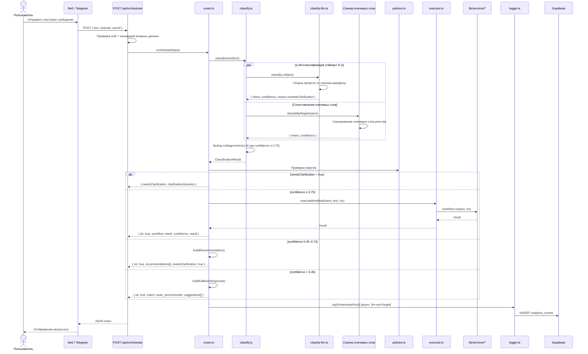
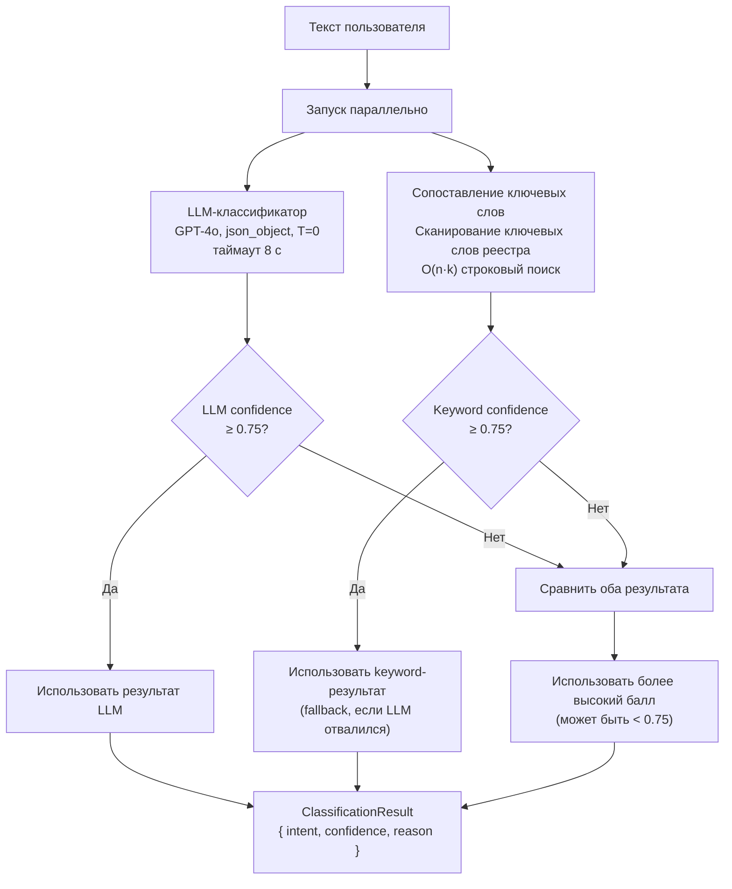
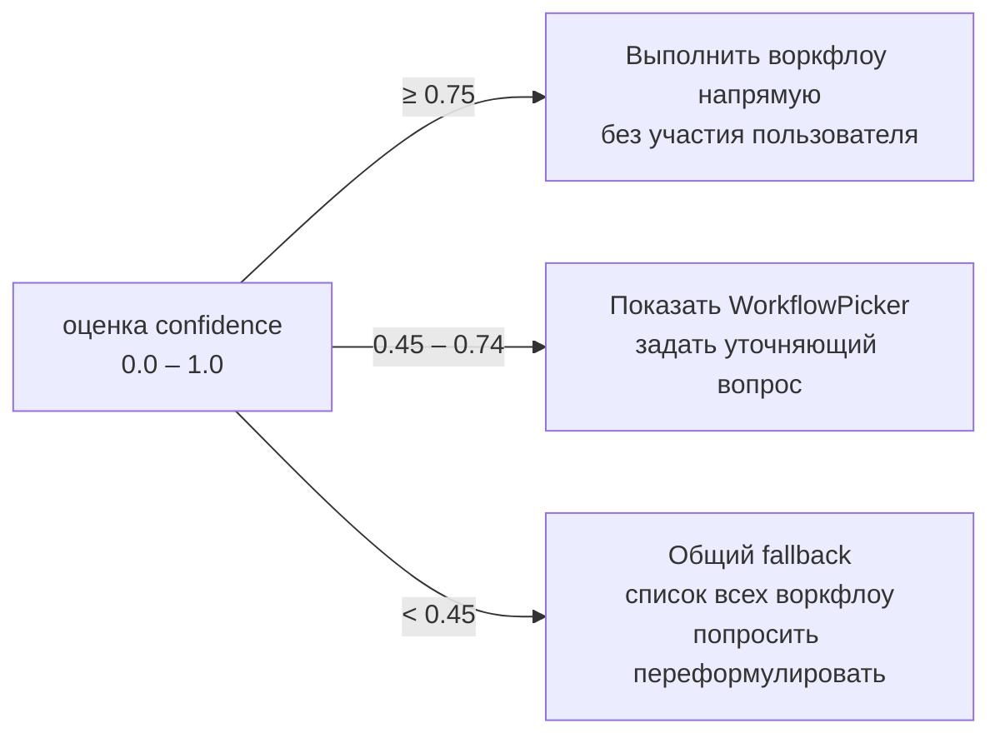

# Оркестратор

Оркестратор — ядро системы маршрутизации. Принимает текст в произвольной форме, классифицирует намерение через гибридную стратегию LLM + ключевые слова и направляет запрос в соответствующий сервис воркфлоу.

---

## Основная последовательность выполнения



---

## Стратегия классификации



**Зачем параллельно?** LLM даёт семантическую точность; ключевые слова — мгновенный fallback, если OpenAI недоступен. Система деградирует мягко, а не критически.

---

## Политика confidence



Пороги определены в `lib/orchestrator/policies.ts` и настраиваются независимо от логики маршрутизации.

---

## Реестр воркфлоу

Определён в `lib/orchestrator/registry.ts`. Каждая запись описывает один воркфлоу:

```typescript
type WorkflowEntry = {
  name: WorkflowName;          // уникальный ID, также используется как метка intent
  description: string;         // отображается в UI WorkflowPicker
  keywords: string[];          // русские + английские триггерные фразы
  minConfidence: number;       // минимум для выполнения (обычно 0.45)
  requiredInputs: string[];    // проверяются исполнителем
  run: (text: string, ctx: WorkflowContext) => Promise<WorkflowResult>;
};
```

Текущий реестр (9 воркфлоу):

| Имя | Ключевые слова (пример) | Обработчик |
|---|---|---|
| `rag_qa` | по материал, найди в документ, вопрос по | `lib/services/content/rag-qa.ts` |
| `letter_generator` | письм, заявлен, обращени | `lib/services/communication/letters.ts` |
| `task_extractor` | дедлайн, задач, список дел | `lib/services/planning/tasks.ts` |
| `lecture_insight` | лекц, конспект, аудио, запись | `lib/services/content/lecture-insight.ts` |
| `study_plan` | план, подготов, расписан | `lib/services/planning/planner.ts` |
| `explain_this` | объясни, что такое, упрости | `lib/services/content/explain.ts` |
| `cheat_sheet` | шпаргал, кратко, сжато | `lib/services/content/cheatsheet.ts` |
| `quiz_generator` | тест, вопросы, проверь знан | `lib/services/content/quiz.ts` |
| `route_recommender` | *(fallback, ключевых слов нет)* | встроенный builder fallback |

**Добавление нового воркфлоу:** добавить одну запись в `WORKFLOW_REGISTRY` в `registry.ts`. Больше ничего менять не нужно.

---

## Контекст воркфлоу

```typescript
type WorkflowContext = {
  userId: string;           // Supabase auth user ID (обязателен для запросов к БД)
  channel: "web" | "telegram";
  attachments?: unknown[];  // ссылки на загруженные файлы
};
```

---

## Структура LLM-промпта

Промпт классификатора (в `classify-llm.ts`) динамически перечисляет все зарегистрированные воркфлоу:

```
System:
  Ты классификатор намерений для студенческого AI-ассистента.
  Доступные воркфлоу:
  - rag_qa: Отвечать на вопросы по документам студента
  - letter_generator: Писать официальные письма и заявления
  ... (все 9 воркфлоу)

  Отвечай ТОЛЬКО JSON:
  {
    "intent": "<workflow_name>",
    "confidence": 0.0-1.0,
    "reason": "<одно предложение>",
    "needs_clarification": false,
    "clarification_question": null
  }

User:
  <текст пользователя>
```

Настройки: `temperature: 0`, `max_tokens: 200`, `response_format: json_object`

---

## Схема логирования

Каждый вызов `orchestrate()` записывает строку в `orchestrator_runs`:

```typescript
{
  user_id:     string,        // auth-пользователь
  input_text:  string,        // обрезан до 500 символов
  intent:      WorkflowName,
  confidence:  number,
  workflow:    string | null, // null при fallback
  status:      "success" | "fallback" | "error",
  latency_ms:  number,        // end-to-end
  channel:     "web" | "telegram"
}
```

Записывается через `Promise.allSettled` (fire-and-forget) — ошибка логгера никогда не ломает ответ.
