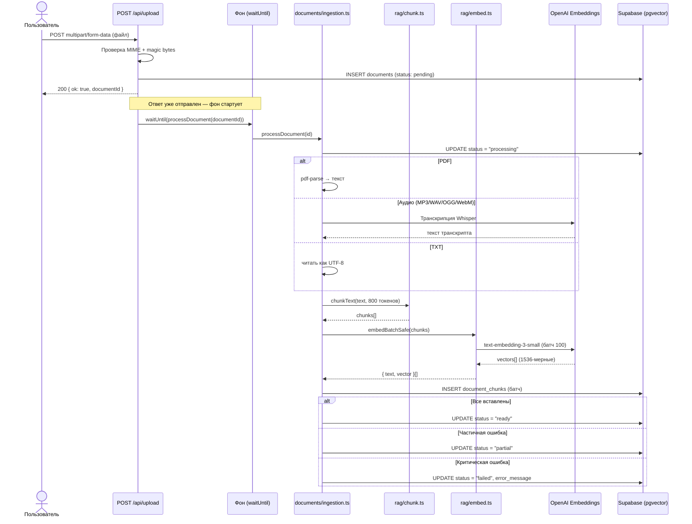
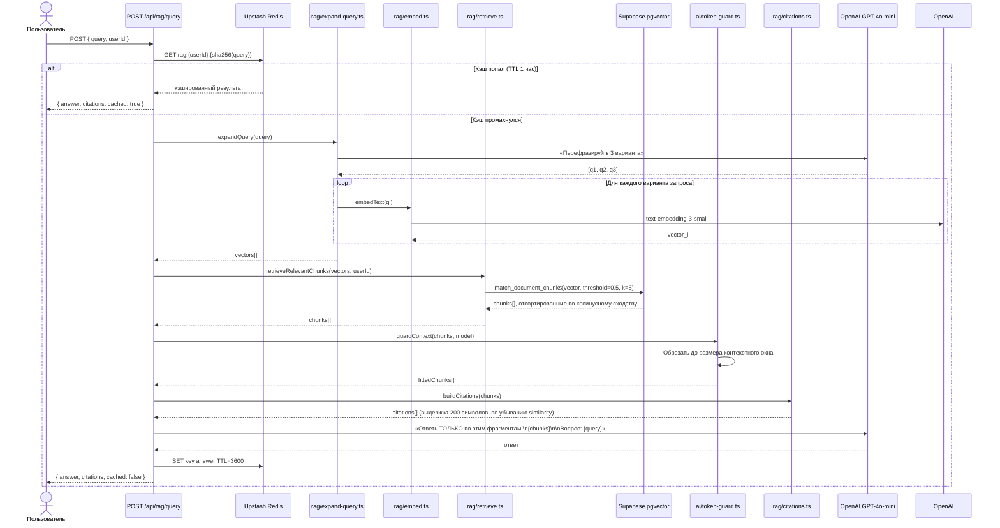

# RAG-пайплайн

Retrieval-Augmented Generation по документам, загруженным пользователем.

---

## Загрузка → Обработка → Поиск



---

## Поток запроса



---

## Алгоритм чанкинга

**Файл:** `lib/rag/chunk.ts`
**Размер чанка по умолчанию:** 800 токенов (~3200 символов)
**Перекрытие:** последние 2 предложения переносятся в следующий чанк

```
Входной текст
    ↓
Нормализация пробелов, разбивка на абзацы
    ↓
Накопление абзацев до достижения размера чанка
    ↓  → При заполнении: сброс чанка, перенос предложений overlap
Обнаружение слишком длинных одиночных абзацев
    ↓  → Разбивка по границе предложения
Слияние слишком коротких хвостовых чанков (< 100 токенов) с предыдущим
    ↓
Результат: string[]
```

Определение заголовков (маркеры естественных точек разбивки):
- Markdown: `^#{1,6}\s`
- Жирный текст: `\*\*[A-ZА-Я]`
- ЗАГЛАВНЫЕ СЛОВА: `^[A-ZА-Я]{3,}`

---

## Стратегия эмбеддингов

**Модель:** `text-embedding-3-small` — 1536 измерений, лучшее соотношение цена/качество для RAG
**Размер батча:** 100 текстов на один API-вызов
**Повтор при ошибке:** экспоненциальный backoff (3 попытки, задержки 1 с / 2 с / 4 с)
**Мягкая деградация:** `embedBatchSafe()` пропускает отдельные ошибки, логирует их, возвращает частичный результат

```typescript
// lib/rag/embed.ts
embedText(text: string): Promise<number[]>
embedBatch(texts: string[]): Promise<number[][]>
embedBatchSafe(texts: string[]): Promise<{ text: string; vector: number[] }[]>
```

---

## Поиск

**Файл:** `lib/rag/retrieve.ts`

```typescript
retrieveRelevantChunks(query: string, userId: string, options?: {
  matchThreshold?: number;  // по умолчанию: 0.5
  matchCount?: number;      // по умолчанию: 5
}): Promise<RetrievedChunk[]>
```

Использует Supabase RPC `match_document_chunks()`, которая фильтрует по `user_id` (безопасно для RLS) и применяет порог косинусного расстояния перед возвратом.

Форма результата:

```typescript
type RetrievedChunk = {
  id: string;
  document_id: string;
  chunk_text: string;
  chunk_index: number;
  similarity: number;      // 0.0 – 1.0
  document_title: string;
};
```

---

## Расширение запроса

**Файл:** `lib/rag/expand-query.ts`

Переписывает запрос пользователя в 3 варианта с помощью GPT-4o-mini. Это улучшает полноту поиска за счёт синонимов и альтернативных формулировок.

Пример:
```
Входной запрос: "что сказал Кейнс про спрос?"

Варианты:
  1. "теория спроса Кейнс кейнсианская экономика"
  2. "Кейнс эффективный спрос совокупный спрос макроэкономика"
  3. "Keynes demand theory aggregate effective demand"
```

Все 3 варианта эмбеддируются и ищутся; результаты объединяются и дедуплицируются по ID чанка.

---

## Цитаты

**Файл:** `lib/rag/citations.ts`

Для каждого найденного чанка извлекает выдержку из 200 символов с центрированием вокруг наиболее релевантного предложения:

```typescript
type Citation = {
  documentTitle: string;
  excerpt: string;         // 200 символов, до границы предложения
  chunkIndex: number;
  similarity: number;
};
```

Цитаты сортируются по убыванию similarity и передаются на фронтенд для отображения.

---

## Защита контекста

**Файл:** `lib/ai/token-guard.ts`

Обрезает массив чанков, чтобы он помещался в контекстное окно модели, учитывая:
- Токены системного промпта
- Токены запроса пользователя
- Количество токенов каждого чанка (оценка: символы / 4)
- Бюджет ответа (резервировано 1000 токенов)

```typescript
guardContext(chunks: string[], model: string, systemPrompt: string, query: string): string[]
```

Предотвращает ошибки `context_length_exceeded` при работе с длинными документами.
